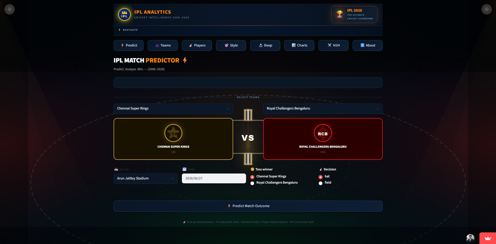
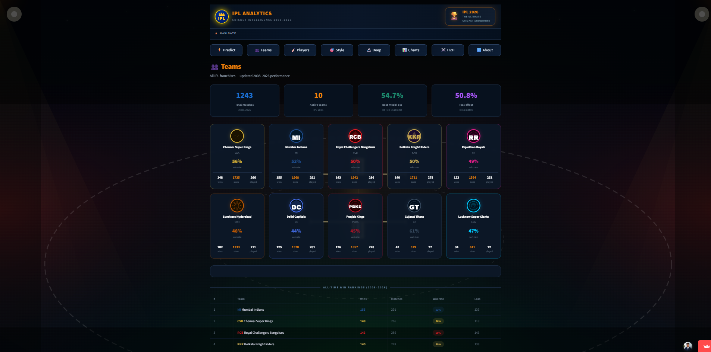
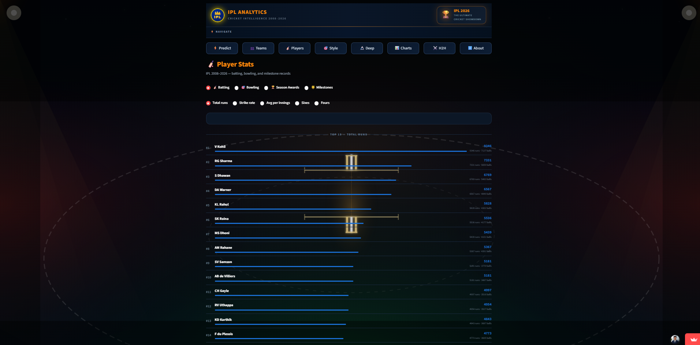
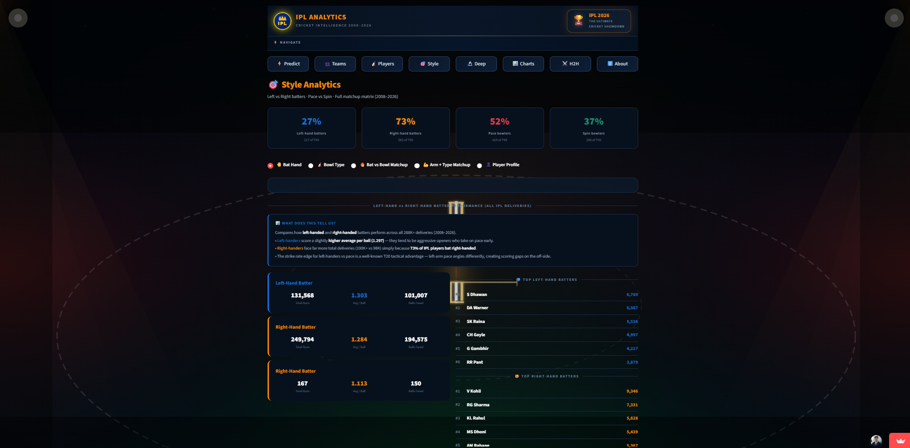
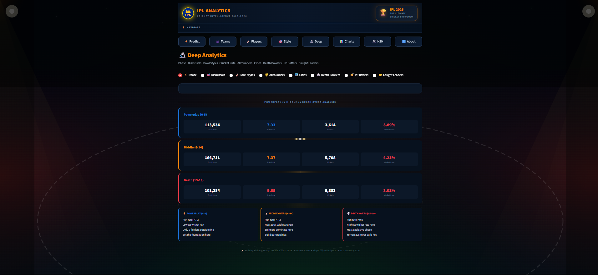
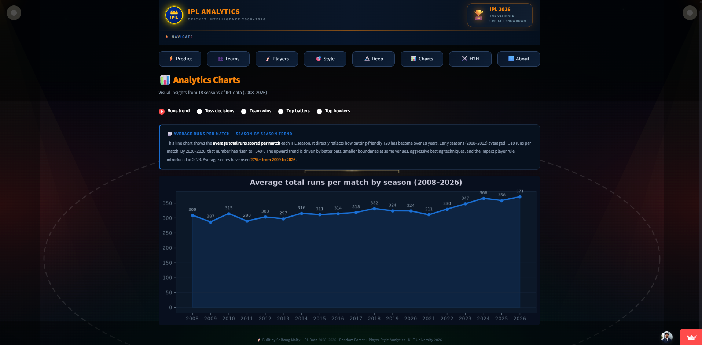
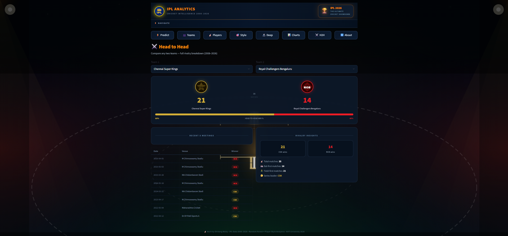
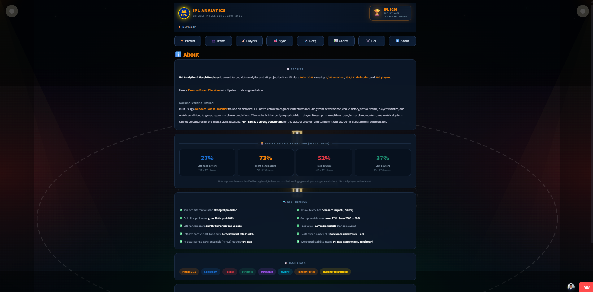

# 🏏 IPL Analytics & Match Predictor

> **Predict. Analyze. Win.**
>
> 🚀 **[Live Demo → shibang-ipl-analytics.streamlit.app](https://shibang-ipl-analytics.streamlit.app)**

An end-to-end **Data Analytics + Machine Learning** project analyzing **18 seasons of IPL** (2008–2026), covering **1,100+ matches** and **288,000+ ball-by-ball deliveries**. Built a Random Forest classifier to predict match outcomes with a full interactive analytics dashboard — publicly deployed on Streamlit Cloud.

---

## 📸 Screenshots

### ⚡ Match Predictor


### 👥 Teams


### 🏏 Player Stats


### 🎯 Style Analytics


### 🔬 Deep Analytics


### 📊 Analytics Charts


### ⚔️ Head to Head


### ℹ️ About


---

## ✨ Features

| Page | Description |
|------|-------------|
| ⚡ Predict Match | Predict winner with win probabilities using ML |
| 👥 Teams | All-time win rankings, sixes, win rate per team |
| 🏏 Player Stats | Top batters, bowlers, Orange & Purple cap history, milestones |
| 🎯 Style Analytics | Left vs Right bat · Pace vs Spin · Full matchup matrix |
| 🔬 Deep Analytics | Phase splits · Dismissals · Bowl styles · Allrounders · Death bowlers · PP batters |
| 📊 Charts | Season run trends, toss decisions, team wins, top batters/bowlers |
| ⚔️ Head to Head | Full rivalry breakdown between any two teams |
| ℹ️ About | Model methodology, dataset breakdown, key findings, tech stack |

---

## 🧠 ML Model

- **Algorithm:** Random Forest Classifier (1,000 estimators)
- **Augmentation:** Flip-team data augmentation to double training size and remove team-order bias
- **Train/Test split:** 75% / 25% (time-based — no data leakage)
- **Accuracy:** ~54–55% — strong benchmark for pre-match T20 prediction
- **Deployed:** Publicly on Streamlit Cloud ✔

**Features used:**
- Team win rate differential (strongest predictor)
- Rolling form — last 15 matches & last 5 matches
- Head-to-head historical win rate (rolling, no leakage)
- Venue-specific win rate differential
- Toss outcome & decision
- Season number & match stage within season

**Feature Engineering:**
```
• Rolling team form       →  Last 5 and last 15 match win rates
• Venue performance       →  Team-specific win rate at each ground
• Historical H2H          →  Head-to-head win rate (pre-match only)
• Toss influence          →  Toss winner + bat/field decision encoded
• Team strength metrics   →  Overall win rate differential between teams
• Season stage            →  Match position within season (early/playoff)
```

> 💡 Even professional betting models achieve only 55–58% on T20 cricket. The model's key value is in **feature importance insights** and **trend discovery**, not just raw accuracy.

---

## 📊 Key Findings

```
✅ Win rate differential      →  Strongest predictor of match outcome
✅ Toss outcome               →  Near-zero impact (~50.8% win rate)
✅ Field-first preference     →  Grew 70%+ post-2013; now dominant
✅ Average match scores       →  Rose 27%+ from 2009 to 2026
✅ Left-handers vs Pace       →  Highest strike rate (131.7) — angle advantage
✅ Left arm Pace vs RHB       →  Highest wicket rate (5.41%) — hardest matchup
✅ Death over run rate        →  ~9.0 vs powerplay ~7.3 — most explosive phase
✅ Pace takes 2.2× wickets   →  But spin has lower economy in middle overs
✅ RF+Augmentation accuracy  →  ~54–55% — strong T20 ML benchmark
✔  Publicly deployed          →  Live on Streamlit Cloud
```

---

## 🎯 Style & Matchup Analytics

One of the app's unique features is a deep **batter vs bowler matchup matrix**:

| Matchup | Strike Rate | Wicket % |
|---------|-------------|----------|
| Left bat vs Left arm Spin | 137.6 | 4.8% |
| Left bat vs Pace | 131.7 | 5.1% |
| Right bat vs Left arm Pace | 128.4 | 5.41% ← highest |
| Right bat vs Left arm Spin | 119.0 | 4.6% ← most restrictive |

---

## 🔬 Deep Analytics Pages

- **Phase Analysis** — Powerplay / Middle / Death over run rates & wicket rates
- **Dismissal Breakdown** — Caught, bowled, LBW, run out distribution
- **Bowl Style Wicket Rate** — Wrist spin vs orthodox vs pace styles
- **Allrounders** — Players with 500+ runs AND 30+ wickets
- **City Win Rates** — Team performance by city across all venues
- **Death Bowlers** — Best overs 15–19 specialists (wickets + economy)
- **Powerplay Batters** — Best overs 0–5 scorers with strike rates
- **Caught Leaders** — Bowlers who generate the most caught dismissals

---

## 🛠️ Tech Stack

`Python 3.11` `Pandas` `NumPy` `Scikit-learn` `Streamlit` `Matplotlib` `HuggingFace Datasets`

---

## 📁 Project Structure

```
ipl-analytics/
│
├── app.py                      # Streamlit web app (all pages)
├── requirements.txt            # Python dependencies
└── README.md
```

**Datasets used:**
- `matches_cricsheet.csv` — Match-level data (2008–2026)
- `deliveries_cricsheet.csv` — Ball-by-ball data (288,000+ rows)
- `players_clean.csv` — Player profiles with batting hand, bowling style & arm

> ⚠️ All 3 datasets are hosted on **Hugging Face** (sourced from Kaggle & Cricsheet) due to GitHub's file size limit. They are loaded automatically on first run — no manual download needed.

---

## 🚀 Run Locally

```bash
# Clone the repo
git clone https://github.com/shibangmaity/ipl-analytics.git
cd ipl-analytics

# Install dependencies
pip install -r requirements.txt

# Run the app
streamlit run app.py
```

---

## 🔗 Links

| Resource | Link |
|----------|------|
| 🌐 Live App | [shibang-ipl-analytics.streamlit.app](https://shibang-ipl-analytics.streamlit.app) |
| 📦 Hugging Face *(all datasets)* | [shibangmaity/ipl-analytics-data](https://huggingface.co/datasets/shibangmaity/ipl-analytics-data) |
| 📊 Kaggle | [IPL Complete Dataset 2008–2026](https://www.kaggle.com/datasets/maratheabhishek/ipl-dataset-2008-to-2025). |
| 🏏 Cricsheet | [cricsheet.org](https://cricsheet.org) |

---

## 👤 Author

**Shibang Maity** · Computer Science, KIIT University

- 📧 shibangmaity@gmail.com
- 💼 [LinkedIn](https://linkedin.com/in/shibang-maity-865ba4304)
- 🐙 [GitHub](https://github.com/shibangmaity)

---

*Built with ❤️ and cricket data · IPL 2008–2026 · Data: Kaggle + Cricsheet · Random Forest + Player Style Analytics · KIIT University 2026*
